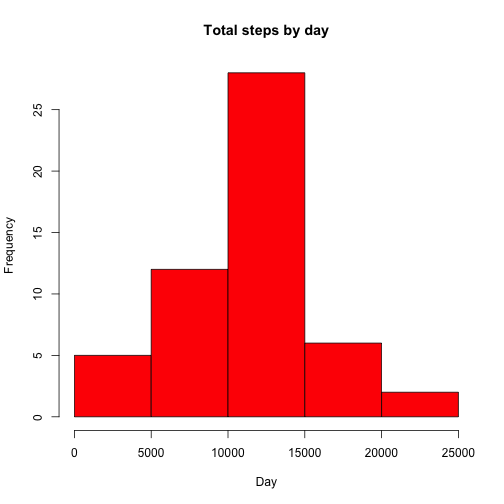
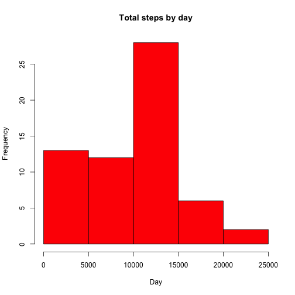

Reproducible Research: Peer Assessment 1
========================================
https://github.com/burakkk/RepData_PeerAssessment1/PA1_template.html  

## Loading and preprocessing the data

```r
activity <- read.csv("activity.csv")
```
Data must unzip before the code execute.

## What is mean total number of steps taken per day?
- Calculate the total number of steps taken per day

```r
agg_data <- aggregate(steps ~ date, activity, sum, na.rm = TRUE)
hist(agg_data$steps, main="Total steps by day", xlab="Day", col="red")
```

 

- If you do not understand the difference between a histogram and a barplot, research the difference between them. Make a histogram of the total number of steps taken each day
With bar charts, each column represents a group defined by a categorical variable; and with histograms, each column represents a group defined by a quantitative variable

- Calculate and report the mean and median of the total number of steps taken per day

```r
mean(agg_data$steps)
```

```
## [1] 10766.19
```

```r
median(agg_data$steps)
```

```
## [1] 10765
```

## What is the average daily activity pattern?
- Make a time series plot (i.e. `type = "l"`) of the 5-minute
   interval (x-axis) and the average number of steps taken, averaged
   across all days (y-axis)

```r
agg_data <- aggregate(steps ~ interval, data=activity, mean)
plot(agg_data, type="l",xlab = "5-min interval", ylab = "Average across all days (Steps)", 
     main = "Average number of steps taken")
```

 

- Which 5-minute interval, on average across all the days in the dataset, contains the maximum number of steps?

```r
agg_data$interval[which.max(agg_data$steps)]
```

```
## [1] 835
```

## Imputing missing values
- Calculate and report the total number of missing values in the
   dataset (i.e. the total number of rows with `NA`s)

```r
sum(is.na(activity))
```

```
## [1] 2304
```
- Devise a strategy for filling in all of the missing values in the
   dataset. The strategy does not need to be sophisticated. For
   example, you could use the mean/median for that day, or the mean
   for that 5-minute interval, etc.
The strategy is using the median for the 5-minute intervals as fillers for missing values.


- Create a new dataset that is equal to the original dataset but with
   the missing data filled in.

```r
agg_data <- aggregate(steps ~ interval, data=activity, median)
newActivity <- merge(activity, agg_data, by="interval", suffixes=c("",".median"))
missingAct <- is.na(newActivity$steps)
newActivity$steps[missingAct] <- newActivity$steps.median[missingAct]
newActivity <- newActivity[,c(1:3)]
```
- Make a histogram of the total number of steps taken each day and
   Calculate and report the **mean** and **median** total number of
   steps taken per day. Do these values differ from the estimates from
   the first part of the assignment? What is the impact of imputing
   missing data on the estimates of the total daily number of steps?

```r
agg_data <- aggregate(steps ~ date, data=newActivity, sum)
hist(agg_data$steps, main="Total steps by day", xlab="Day", col="red")
```

 

```r
mean(agg_data$steps)
```

```
## [1] 9503.869
```

```r
median(agg_data$steps)
```

```
## [1] 10395
```
The impact of imputing missing data on the estimates of the total daily number of steps seems changed  when we look at the histogram. Median value also is changed a little bit lower but mean value is changed dramatically. It makes sense because using median suppose to change it but when we'll use mean value, it will be seen that there isn't too much change. 

## Are there differences in activity patterns between weekdays and weekends?
- Create a new factor variable in the dataset with two levels --
   "weekday" and "weekend" indicating whether a given date is a
   weekday or weekend day.


```r
dayFlag <- function(date) {
  if (weekdays(as.Date(date)) %in% c("Saturday", "Sunday")) {
    "weekend"
  } else {
    "weekday"
  }
}
activity$dayFlag <- as.factor(sapply(activity$date, dayFlag))
```

- Make a panel plot containing a time series plot (i.e. `type = "l"`)
   of the 5-minute interval (x-axis) and the average number of steps
   taken, averaged across all weekday days or weekend days
   (y-axis).

```r
library(lattice)
agg_data <- aggregate(steps ~ interval + dayFlag, data=activity, mean)
names(agg_data) <- c("interval", "dayFlag", "steps")
xyplot(steps ~ interval | dayFlag, agg_data, type = "l", layout = c(1, 2), 
       xlab = "Interval", ylab = "Number of steps")
```

 
